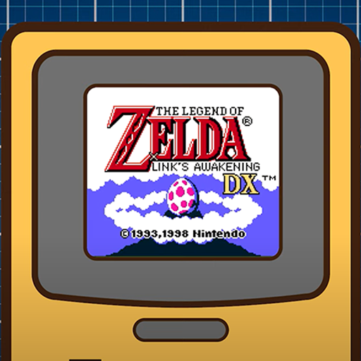

# 🎮 Zelda Reinforcement AI 💎

**'An experiment in making a script control a Zelda game'**

---

## Description

Welcome to the AI Zelda GitHub repository! This project is an experiment in using artificial intelligence to play one of my favorite games of all time, The Legend of Zelda: Link's Awakening. This repository contains the code, resources, and commit history for training a neural network to navigate and play the game autonomously.

## Project Overview
Link's Awakening was a groundbreaking title when it first released, introducing new ideas and gameplay mechanics that redefined what a Zelda game could be on a handheld console. With the announcement of its spiritual successor, I decided to revisit this classic game in a unique way—by seeing if AI could learn to play it.

## Results
After weeks of training and numerous iterations, the AI made significant progress, even obtaining the Master Sword at one point. However, challenges remain, particularly in combat and advancing deeper into the game.

---

  
  
  

